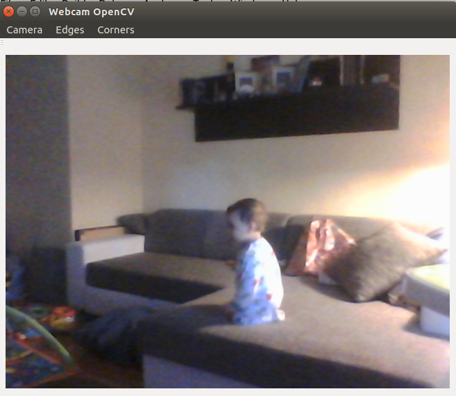
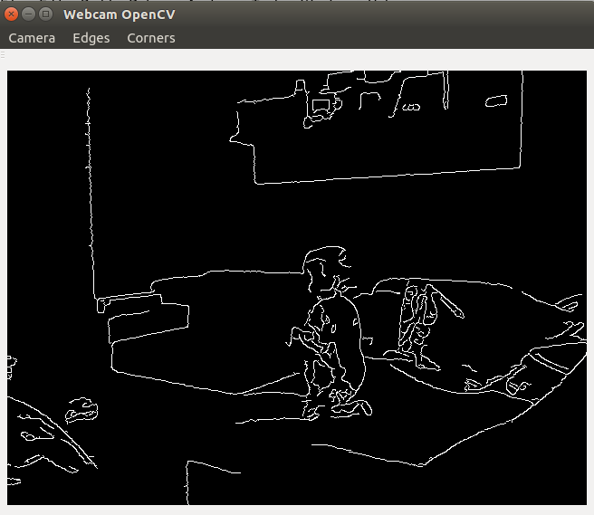
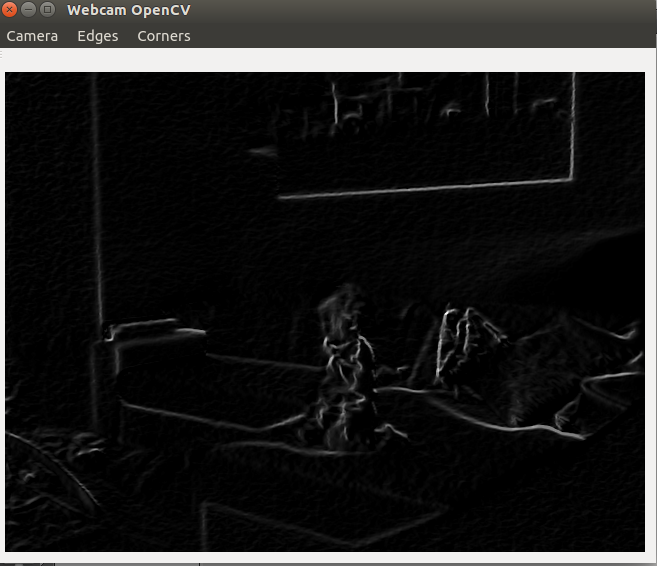
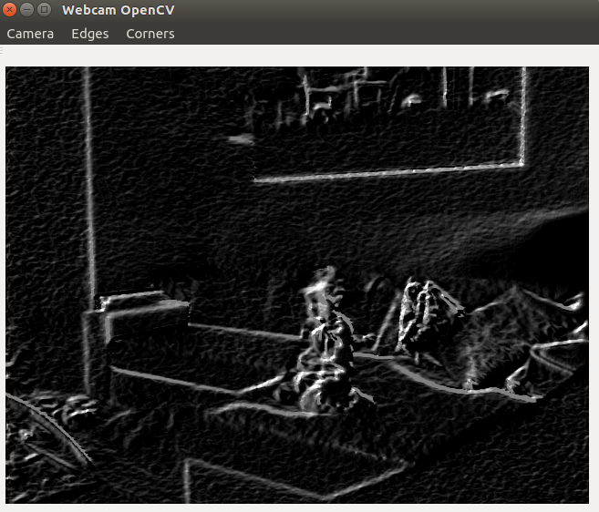
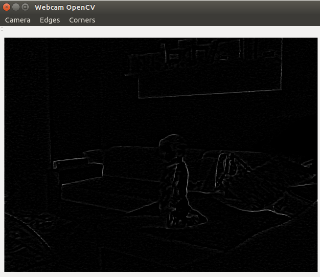

## Webcam project

Simple project that shows the webcam in a QLabel with the use of Qt libraries,
it also allows for testing some filters in the images. 

### Roadmap - 12/07/2014

* Add Transformations
* Add Blur - noise
* Add Motion Estimation

### Installation

This program was build with:

* Qt 5.3.1
* Opencv 2.4.9
* In Ubuntu 14.04 - 64 bit

## Screenshots - (Images may not be from the latest version)

### Normal webcam - Main window

### Parameters window

## Edges

### Canny

### Sobel

### Scharr

### Laplace

### Morphological gradient

